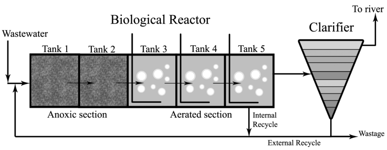

# RL-ETAR-BSM1

⚠️ Este repositório está em construção como parte de um projeto de pesquisa de doutorado (2025–2028).  
Os notebooks, dados e scripts serão atualizados gradualmente. Comentários e sugestões são bem-vindos.

## Objetivo do projeto
Desenvolver um modelo de controle baseado em Aprendizado por Reforço (RL) para otimizar a operação de Estações de Tratamento de Águas Residuárias (ETARs), com foco em eficiência energética, qualidade do efluente e redução de emissões.

## 🏗️ Esquema de la planta BSM1

## Estrutura prevista do repositório

/notebooks/ # Notebooks em Google Colab /data/ # Dados de entrada e saída simulados /src/ # Scripts Python para simulação e RL README.md # Você está aqui requirements.txt # Dependências do projeto

## Licença
Este projeto está licenciado sob a [MIT License](LICENSE).
